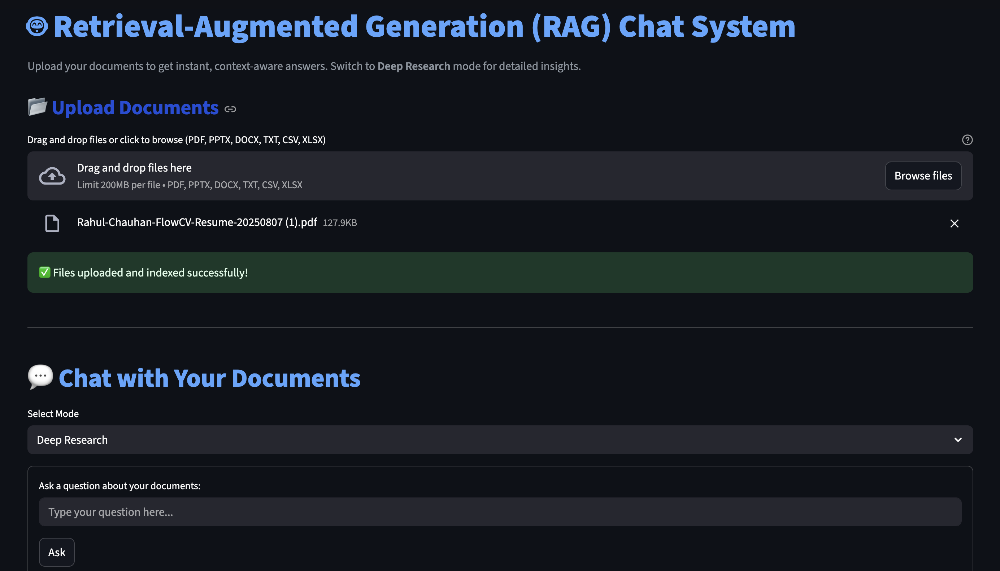
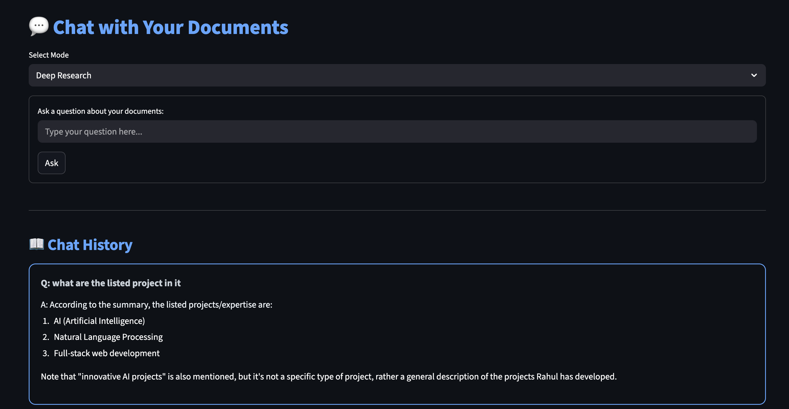
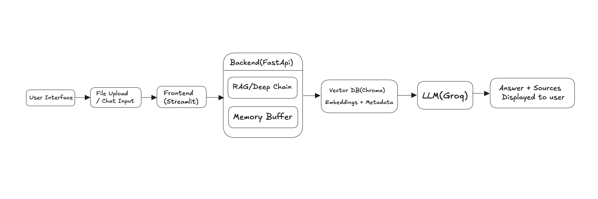
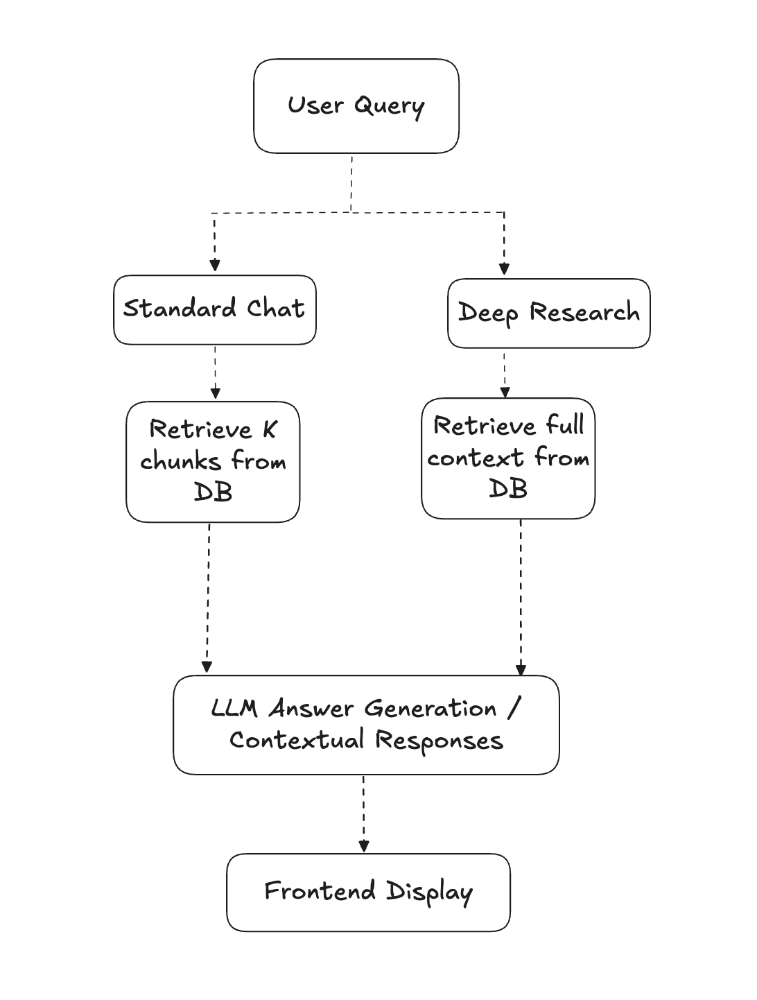
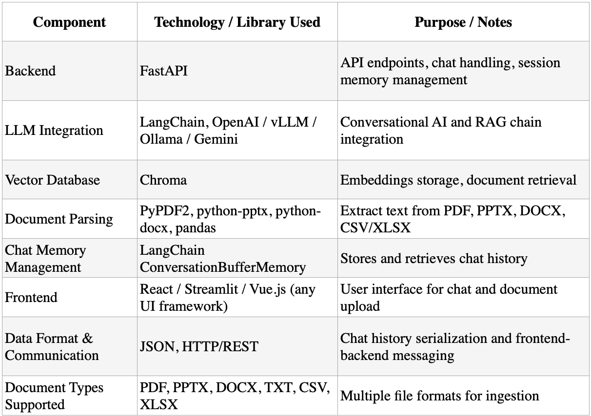

# RAG Chat System

RAG Chat System is a professional-grade, document-focused Retrieval-Augmented Generation (RAG) chat system. It allows users to upload multiple document types, interact via a chat interface, and perform deep research queries using state-of-the-art LLMs. The system supports contextual responses, vector-based retrieval, and an intuitive Streamlit UI for effortless document Q&A.

The project demonstrates:
- Multi-format document ingestion (PDF, PPTX, DOCX, TXT, CSV, XLSX)
- Automatic text extraction and chunking
- Vector embeddings and similarity-based retrieval
- Standard Chat and Deep Research functionalities
- Modular, scalable backend with LLM integration

---

 🚀 Demo

 🖥️ Streamlit UI Screenshots



---


 ✨ Features

 Document Processing
- Bulk document upload
- Automatic text extraction and chunking
- Support for PDF, PPTX, DOCX, TXT, CSV, XLSX
- Vector embeddings generation and storage (Chroma)

 Standard Chat
- Query uploaded documents in natural language
- Contextual responses based on document content
- Chat history management

 Deep Research Mode
- Extended context search
- Detailed answer generation
- Retrieval from full document content

 Additional Features
- Clean Streamlit-based UI
- Modular code structure
- Easy integration with LLM (Groq API)
- Vector DB  (Chroma)

---

 🧠 Architecture Overview

The system is designed as a modular pipeline, from document ingestion to answer generation. Each component is decoupled to allow flexibility, scalability, and easy extension.

 Architecture Diagram 1


 Architecture Diagram 2


---

⚙️ Technology Stack



---


```
 📁 Project Structure

rag-chat-system/
│
├── rag_chat/                # Core pipeline logic
│   ├── loader.py            # Document loading
│   ├── chunker.py           # Chunking logic
│   ├── embedder.py          # Embedding generation
│   ├── vector_store.py      # Vector DB interaction
│   ├── chat.py              # Standard chat logic
│   ├── deep_research.py     # Deep research module
│   └── llm_wrapper.py       # LLM abstraction
│
├── ui.py                    # Streamlit UI
├── requirements.txt         # Python dependencies
├── runtime.txt              # Python version
├── Procfile                 # Web server entry point
├── .streamlit/
│   └── config.toml          # Theme and server settings
└── assets/                  # Screenshots & architecture images
    ├── Architecture1.png
    ├── Architecture2.png
    ├── streamlitui1.png
    ├── streamlitui2.png
    └── techstack.png

```

```
🛠️ Setup & Installation

 🔧 Local Development

1. Clone the repository:

    git clone https://github.com/yourusername/rag-chat-system.git
    cd rag-chat-system

2.Create a virtual environment:

    python -m venv venv
    source venv/bin/activate  # Windows: venv\Scripts\activate

3.Install dependencies:

    pip install -r requirements.txt

4.Run the Streamlit app:

    streamlit run ui.py
```

```
⚡ Technical Choices & Challenges

Vector DB: Chroma was chosen for its lightweight local setup and LangChain compatibility.

LLM Integration: Groq API for high-quality contextual responses; 

Document Types: Handled multiple formats (PDF, PPTX, DOCX, CSV, TXT, XLSX) using PyMuPDF, python-pptx, pandas, and python-docx.

Chunking: Used semantic chunking for optimal retrieval performance.

Challenges:

Parsing heterogeneous document formats reliably

Ensuring embeddings were consistent across chunked text

Integrating Deep Research mode with full document context retrieval
```

```
🤝 Contributing

Contributions are welcome! Submit issues or pull requests.

```

```

📜 License

MIT License © Rahul Chauhan

```

```
🙌 Acknowledgments

LangChain for modular building blocks

HuggingFace & Sentence-Transformers for embeddings

```
